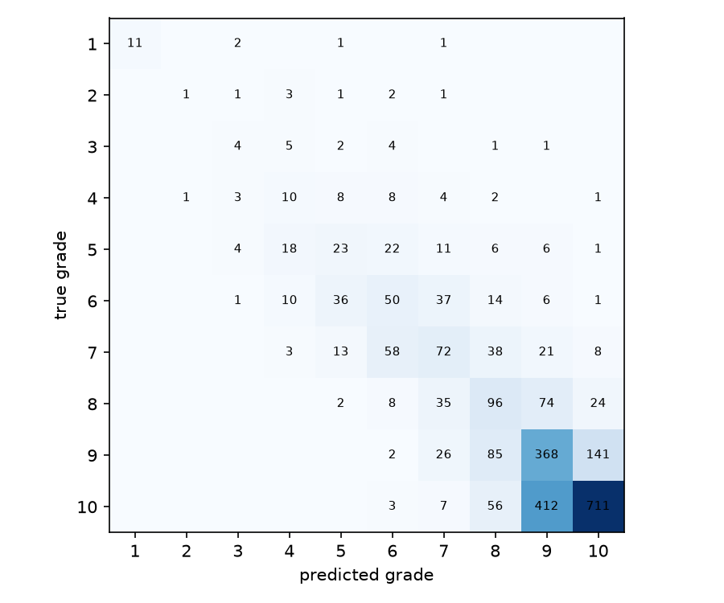

# Card Grade Estimation (image-analysis)

Estimating the PSA grade (1-10) of a Pokemon trading card from scans of its front and back, using a PyTorch model trained on real graded cards.

*Not affiliated with or endorsed by PSA. Grades in the data come from PSA-graded cards, but this model's output is only an estimate.*

## Overview

Given a front and back scan of a card, the model predicts a single number: the expected PSA grade. Both views go through one shared ResNet18 backbone, and their features are combined by a small regression head.

The project demonstrates a full ML workflow: data cleaning, a reproducible split, honest baselines, GPU training, and evaluation that doesn't hide behind an imbalanced dataset.

## Dataset

- **Source:** [`jyesr/pokemon-tcg-grading`](https://huggingface.co/datasets/jyesr/pokemon-tcg-grading) on Hugging Face.
- **Contents:** 25,861 cards with both a front and back scan and PSA metadata (grade, cert ID, card name, year, set).
- **Labels:** PSA grade strings (for example `GEM MT 10`) parsed to numbers. Not independently re-verified against PSA's cert lookup.
- **Cleaning:** rows without a grade, "Authentic" cards, and half grades (such as 8.5) are dropped. Only cards with both a front and back image are kept.
- **Split:** 80/10/10 train/val/test (20,688 / 2,586 / 2,587 cards), stratified by grade and split by card ID so both sides of a card are always in the same split.
- **Licensing:** the dataset page did not show a license when checked. The data is not redistributed in this repo; download it with the script below.

**Grade distribution (full dataset, 25,861 cards):** heavily skewed toward high grades.

| Grade | 1 | 2 | 3 | 4 | 5 | 6 | 7 | 8 | 9 | 10 |
|---|---|---|---|---|---|---|---|---|---|---|
| Cards | 153 | 89 | 177 | 368 | 904 | 1,550 | 2,124 | 2,391 | 6,222 | 11,883 |

## Approach

1. **Preprocessing:** images are rotated to portrait, resized to 352x512, and cached to disk (`data/interim/images/`).
2. **Model:** ImageNet-pretrained ResNet18, shared between the front and back views. The two 512-dimensional feature vectors are concatenated and passed through a small MLP to one output.
3. **Training:** regression with Smooth L1 loss, AdamW (lr 3e-4, weight decay 1e-4), batch size 16, no data augmentation. The checkpoint with the best validation balanced MAE is kept.
4. **Class weighting:** because grades 9-10 make up 70% of cards, the loss for each sample is scaled by an inverse-sqrt-frequency weight per grade. This is the single change that had the largest effect on the model (see Results).
5. **Metrics:**
   - **MAE:** mean absolute error between predicted and true grade.
   - **Balanced MAE:** the per-grade MAE values averaged with equal weight per grade, so common grades can't hide poor performance on rare ones.
   - **Exact / within-1:** rounded prediction equals (or is within 1 of) the true grade.

## Results

Baselines on the test set (2,587 cards):

| Baseline | MAE | Balanced MAE | Exact |
|---|---|---|---|
| Always predict 10 | 1.300 | 4.500 | 46.0% |
| Always predict 9 (median) | 1.219 | 3.700 | 24.0% |

Model results, same test set:

| Model | MAE | Balanced MAE | Exact | Within 1 |
|---|---|---|---|---|
| ResNet18, two views, unweighted | 0.938 | 1.440 | 26.5% | 88.1% |
| **ResNet18, two views, class-weighted** | **0.673** | **1.218** | **52.0%** | **89.6%** |

Class weighting was necessary, not just helpful: the unweighted model's best checkpoint by validation loss had actually collapsed, never once rounding a prediction to grade 10 even for cards that were true 10s. The weighted model doesn't have this failure mode.

Per-grade results for the class-weighted model (test split):

| True grade | Cards | MAE | Mean prediction | Exact | Within 1 |
|---|---|---|---|---|---|
| 1 | 15 | 1.06 | 2.06 | 73.3% | 73.3% |
| 2 | 9 | 2.55 | 4.55 | 11.1% | 22.2% |
| 3 | 17 | 1.91 | 4.86 | 23.5% | 52.9% |
| 4 | 37 | 1.62 | 5.32 | 27.0% | 56.8% |
| 5 | 91 | 1.29 | 5.68 | 25.3% | 69.2% |
| 6 | 155 | 0.97 | 6.20 | 32.3% | 79.4% |
| 7 | 213 | 0.95 | 7.07 | 33.8% | 78.9% |
| 8 | 239 | 0.79 | 8.26 | 40.2% | 85.8% |
| 9 | 622 | 0.51 | 9.00 | 59.2% | 95.5% |
| 10 | 1,189 | 0.53 | 9.47 | 59.8% | 94.4% |



**What was tried and didn't clearly help:** a longer run (20 epochs) with a lower learning rate (1.5e-4) and light augmentation (small rotation, color jitter) scored about the same balanced MAE (1.208 vs 1.218) but worse on every other metric (MAE 0.782, exact 40.7%). Validation metrics were noisy epoch-to-epoch in both runs, so the checkpoint that happens to be selected can vary more than the two setups actually differ. This is listed as an open problem below rather than treated as a real regression.

## Limitations

- **Grades 2-3 remain weak** (89 and 177 training cards respectively), with high MAE and low exact accuracy. This is close to a small-data problem for those two classes specifically.
- **Grades 4-5 are moderate**, correct within one grade 57-69% of the time but rarely exact.
- **Validation metrics are noisy across epochs**, making single-checkpoint selection somewhat unstable. A smoothed or averaged selection rule would likely be more reliable than picking the single best epoch.
- **Cards of the same design appear many times** in the data. The split is by individual card, not by card design, so the model may partly learn "this specific card design is usually graded X" rather than purely reading condition.
- **Grades are real PSA results**, but the images are scans rather than in-hand photos, so real-world photos (phone cameras, inconsistent lighting) would likely perform worse than these numbers suggest.
- **Data is skewed toward modern Pokemon cards**, so the model may not generalize to other trading card types or eras.

## Project organization

Built from the [Cookiecutter Data Science](https://cookiecutter-data-science.drivendata.org/) template.

```
├── data
│   ├── raw/            <- downloaded shards and metadata.csv (not in git)
│   ├── interim/images/ <- resized card images (not in git)
│   └── processed/      <- index.csv with card IDs, grades and splits
├── image_analysis
│   ├── dataset.py      <- download, cache and split the data
│   └── modeling
│       ├── train.py    <- train the two-view ResNet18 (plain or class-weighted)
│       └── evaluate.py <- per-grade metrics and confusion matrix
├── models/             <- trained weights (not in git)
├── reports/             <- per-grade CSVs and figures used in this README
├── notebooks/
├── tests/
├── pyproject.toml
└── requirements.txt
```

## Setup

Requires Python 3.10 or newer. Developed on Python 3.12, which AMD's Windows ROCm PyTorch build requires.

```bash
python -m venv .venv
# Windows PowerShell: .\.venv\Scripts\Activate.ps1
# macOS/Linux:        source .venv/bin/activate
```

Install PyTorch first for your hardware (see [pytorch.org](https://pytorch.org/get-started/locally/)), then the other requirements:

```bash
pip install -r requirements.txt
pip install huggingface_hub pillow pandas matplotlib scikit-learn
```

**AMD GPU on Windows:** trained on a Radeon RX 9070 XT using AMD's ROCm PyTorch wheels, following [AMD's install guide](https://rocm.docs.amd.com/projects/radeon-ryzen/en/latest/docs/install/installrad/windows/install-pytorch.html). Install those wheels before the other packages, since a plain `pip install torch` gives a CPU-only build. The code also runs on CPU, only much more slowly.

## Usage

```bash
# 1. Download all 8 shards (~26,000 cards), cache resized images, build the train/val/test index
python image_analysis/dataset.py 8

# 2. Train for N epochs, with class weighting (recommended; see Results)
python image_analysis/modeling/train.py 10 weighted

# 3. Per-grade metrics and confusion matrix on the test split
python -m image_analysis.modeling.evaluate full_weighted
```

## Roadmap

- [ ] Resolve grades 2-3 weakness: try oversampling, stronger weighting, or additional data for these classes specifically
- [ ] Investigate validation noise and a more stable checkpoint-selection rule (e.g. averaging over the last few epochs)
- [ ] Split by card design, not just card ID, to rule out design leakage
- [ ] Try ordinal regression/classification instead of plain regression
- [ ] Add tests and a GitHub Actions workflow for linting and tests

## Author

[dtang555](https://github.com/dtang555)

## License

MIT. See [LICENSE](LICENSE).
